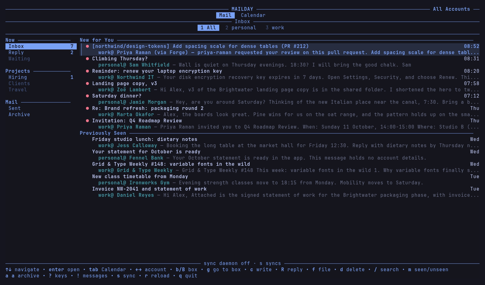
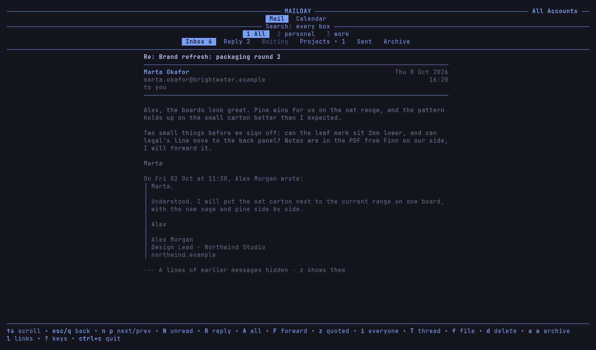
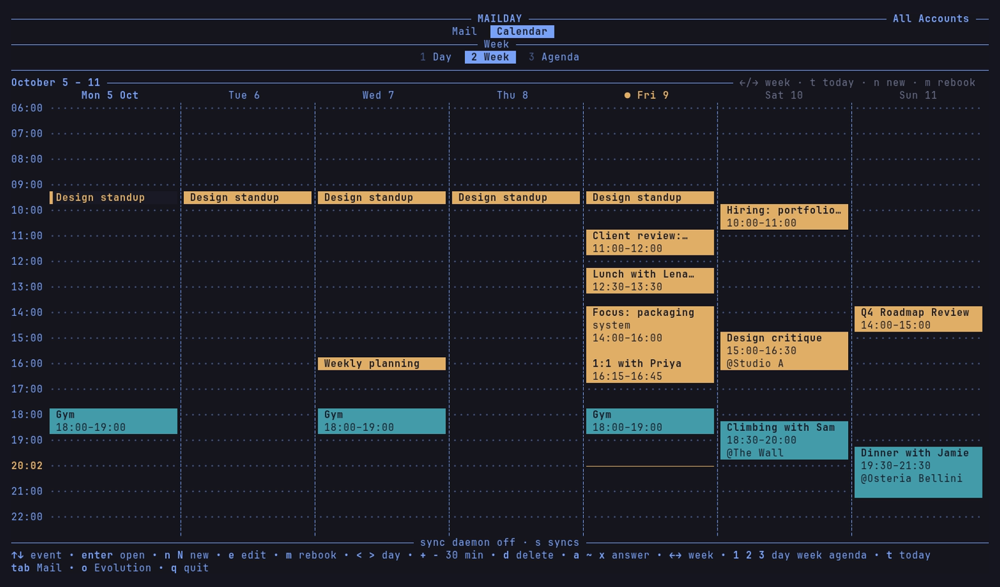
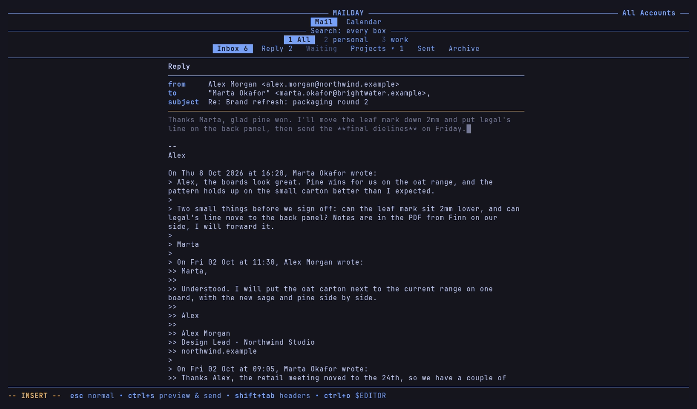
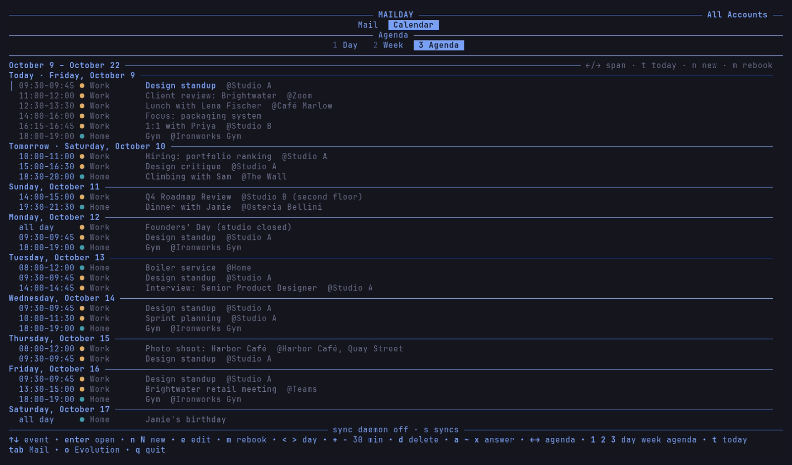

# Mailday

Mailday is a terminal mail and calendar app for mail you already keep in local Maildirs. If you sync with mbsync and send with msmtp, it fits into what you have: it shows your inbox and your week side by side in one full-screen program, and leaves downloading to mbsync, so NeoMutt, notmuch and the mail app on your phone keep working as before.



The look and most of the interface come from HEY's terminal client, [basecamp/hey-cli](https://github.com/basecamp/hey-cli). Mailday keeps those screens and swaps the calls to HEY's servers for your own files: Maildir for mail, ICS for calendars. It is an independent project and not related to 37signals or HEY.

| | |
|---|---|
|  |  |
|  |  |

## What it does

- **Mail from every account in one list.** Each account under `~/Mail` (or `~/.local/share/mail`, as mutt-wizard sets it up) is a tab. `@` folders such as `@Reply` and `@Waiting` become boxes you file into with two keys (`f r`, `f w`).
- **Live, without a sync button.** `mailday-syncd` holds an IMAP IDLE connection per account and runs mbsync for just the folder that changed, so new mail shows within seconds. Your moves go back to the server with IMAP MOVE.
- **A reader that handles real mail.** HTML mail is turned into Markdown and rendered in the terminal, quoted history folds away, and Microsoft Safe Links are unwrapped. Conversations group by Message-ID and References.
- **Writing in Markdown.** Replies and new mail are written in Markdown with Vim keys and sent as plain text plus HTML. Recipients autocomplete from every address in your Maildirs, signatures follow the From address, and attachments are found by typing words from the file name.
- **Snooze.** `Z` moves a message out of the inbox until a time you type (`fri`, `tomorrow 9`, `in 3 days`). The daemon brings it back on the server, so your phone sees it return too.
- **Calendar next to mail.** Day, week and agenda views from ICS files, iCal feeds, Evolution's cache or Microsoft 365 over EWS. New events from one line (`Lunch with Ada fri 12:30 1h @Atrium`), invitations answered from the message, and a strip that tells you when the next meeting starts.
- **Search** through notmuch, bodies included.

## Requirements

- Linux or macOS (it also builds for FreeBSD and OpenBSD)
- Go 1.26 or newer to build
- [isync](https://isync.sourceforge.io/) (`mbsync`) configured for your accounts, and [msmtp](https://marlam.de/msmtp/) for sending
- Optional: notmuch (full-text search), NeoMutt (anything Mailday does not do), [uv](https://docs.astral.sh/uv/) (the calendar scripts), gpg (the Exchange token)

## Install

```sh
git clone https://github.com/aronvandepol/mailday
cd mailday
make install          # mailday, md, mailday-syncd and the calendar scripts into ~/.local/bin
make install-syncd    # Linux: run the sync daemon as a systemd user service
make install-launchd  # macOS: the same as a launchd agent
mailday --check       # what Mailday found, and what is missing
```

Mailday reads your mail accounts from `~/.mbsyncrc` and your sending accounts from your msmtp config, so mbsync and msmtp should already be set up and working. If you run mbsync from a timer or cron job now, turn that off once `mailday-syncd` is running, because the daemon takes over deciding when mbsync runs.

## Configuration

Everything in `~/.config/mailday/config.toml` is optional. With no file, Mailday sends as the `from` address of each msmtp account and keeps its state in `~/.local/share/mailday`. Add identities when you want a display name, signatures or aliases:

```toml
name = "Alex Morgan"
shared_dir = "~/Sync/mailday"        # snooze list and groups, shared between your machines

[[identity]]
accounts = ["work"]                  # the account's folder name under ~/Mail
address = "alex.morgan@northwind.example"
signature = ["Alex Morgan", "Design Lead · Northwind Studio"]
short_signature = ["Alex"]           # under replies

[[identity]]
accounts = ["personal"]
address = "alex@morgan.example"
save_sent = true                     # this server does not keep a Sent copy itself

[mail.box_keys]
"@Clients" = "c"                     # f c files into @Clients, g c goes there

[calendar]
feeds = [{ name = "Holidays", url = "https://example.com/holidays.ics" }]

[exchange]                           # a Microsoft 365 calendar over EWS
user = "alex.morgan@northwind.example"
calendar = "Work"
```

[`config.example.toml`](config.example.toml) lists every key.

## Calendars

Mailday reads `.ics` files from `~/.local/share/mailday/calendars`, and `mailday-calsync` keeps that folder up to date. It downloads the iCal feeds named in your config (every Google calendar has a secret iCal address you can use). Add an `[exchange]` section and run `mailday-exchange authorize` once, and it reads your Microsoft 365 calendar over EWS too. On Linux, Mailday also reads the calendars Evolution has synced. You can edit events in Exchange calendars, and in Google calendars if you point `google_script` at a module that talks to the Google Calendar API.

The Exchange login uses Thunderbird's public Microsoft client ID, because registering your own app takes an admin in most organisations. Whether it works depends on your organisation: some allow Thunderbird to reach your mailbox over EWS, some do not. When it works, the token is stored encrypted to your own gpg key.

## Keys

| Key | Action |
|---|---|
| `tab` | Mail or Calendar |
| `j` `k`, `enter` | Move, open |
| `←` `→`, `1`–`9` | Switch account |
| `b` `B`, `g` + letter | Next box, go to a box |
| `c` `R` `A` `F` | Write, reply, reply all, forward |
| `a a`, `f` + letter, `d` | Archive, file, delete (`u` undoes) |
| `Z` | Snooze |
| `/` | Search |
| `space`, `T` | Open a conversation, show the whole thread |
| `n` (Calendar) | New event from one line |
| `m`, `e` (Calendar) | Rebook, edit |
| `?` | Every key |

The [guide](docs/GUIDE.md) covers every feature and key in detail.

## Contributing

Issues and pull requests are welcome. `make check` runs the tests and vet, `make cross` builds for each supported system, and `make demo` builds a fake home directory with invented mail and calendars, which is what the screenshots above show (`vhs scripts/demo/screenshots.tape` retakes them). Please keep real people and their addresses out of the tests.

## Credits and licence

Mailday is MIT licensed. Parts of the terminal interface, the HTML-to-Markdown reader and the Omarchy theme loading are adapted from [basecamp/hey-cli](https://github.com/basecamp/hey-cli) (MIT, © 37signals); see [THIRD_PARTY_NOTICES.md](THIRD_PARTY_NOTICES.md).
